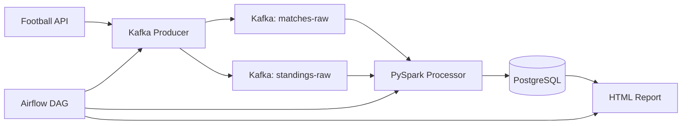

# ⚽ GoalFlow

> A production-grade football analytics pipeline built with Apache Kafka, Apache Spark, Apache Airflow, and PostgreSQL — fully containerized with Docker.


---

## 📋 Table of Contents

- [Overview](#overview)
- [Architecture](#architecture)
- [Tech Stack](#tech-stack)
- [Project Structure](#project-structure)
- [Prerequisites](#prerequisites)
- [Setup & Installation](#setup--installation)
- [Usage](#usage)
- [Services](#services)
- [Pipeline Details](#pipeline-details)
- [Data Schema](#data-schema)
- [Testing](#testing)
- [Makefile Commands](#makefile-commands)
- [Author](#author)

---

## Overview

GoalFlow is an end-to-end data engineering pipeline that ingests live football data from the [API-Football](https://www.api-football.com/) API, streams it through Apache Kafka, processes it with Apache Spark, stores results in PostgreSQL, and generates interactive HTML analytics reports — all orchestrated daily by Apache Airflow.

The project covers the full data engineering lifecycle:

```
Ingest → Stream → Process → Store → Analyze → Report
```

Data is collected for 3 major leagues:
- 🏴󠁧󠁢󠁥󠁮󠁧󠁿 **Premier League** (England)
- 🇪🇸 **La Liga** (Spain)
- 🇮🇹 **Serie A** (Italy)

---

## Architecture



### Pipeline Flow

1. **Ingestion** — `producer.py` polls the Football API every run and produces raw JSON events to two Kafka topics: `matches-raw` and `standings-raw`
2. **Processing** — `processor.py` PySpark batch job reads from Kafka, computes team metrics (form, win rate, goal averages), and writes results to PostgreSQL
3. **Orchestration** — Airflow DAG runs the full pipeline daily at 02:00 UTC: ingest → process → report
4. **Reporting** — `report.py` reads from PostgreSQL and generates an interactive HTML report with 3 Plotly charts

---

## Tech Stack

| Layer | Technology | Version |
|---|---|---|
| Language | Python | 3.11 |
| Message Broker | Apache Kafka | Confluent 7.4.0 |
| Distributed Processing | Apache Spark (PySpark) | 3.5.0 |
| Orchestration | Apache Airflow | 2.8.0 |
| Database | PostgreSQL | 15 |
| Containerization | Docker + Docker Compose | v2 |
| Data Validation | Pydantic + Pandera | latest |
| Visualization | Plotly | latest |
| Logging | Loguru | latest |
| Testing | Pytest | latest |

---

## Project Structure

```
goalflow/
├── docker-compose.yml          # 7 services: zookeeper, kafka, postgres,
│                               #   airflow, spark, ingestion, analytics
├── .env.example                # Environment variables template
├── Makefile                    # Shortcut commands
├── README.md
├── init.sql                    # PostgreSQL schema initialization
│
├── ingestion/
│   ├── Dockerfile
│   ├── requirements.txt
│   └── producer.py             # Football API → Kafka producer
│
├── spark/
│   ├── Dockerfile
│   ├── requirements.txt
│   └── processor.py            # PySpark batch processing job
│
├── airflow/
│   ├── Dockerfile
│   └── dags/
│       └── pipeline_dag.py     # Daily orchestration DAG
│
├── analytics/
│   ├── Dockerfile
│   ├── requirements.txt
│   └── report.py               # Plotly HTML report generator
│
└── tests/
    ├── conftest.py
    ├── test_producer.py
    └── test_processor.py
```

---

## Prerequisites

- [Docker Desktop](https://www.docker.com/products/docker-desktop/) 4.x or later
- `make` (pre-installed on macOS/Linux; Windows: install via [Chocolatey](https://chocolatey.org/))
- A free API key from [API-Football](https://dashboard.api-football.com/register) (100 requests/day on free tier)
- Minimum **8GB RAM** available for Docker

---

## Setup & Installation

### Step 1 — Clone and configure

```bash
git clone https://github.com/Mohamed-Chaari/goalflow.git
cd goalflow
cp .env.example .env
```

Open `.env` and add your Football API key:

```env
FOOTBALL_API_KEY=your_actual_key_here
```

### Step 2 — Start the pipeline

```bash
make up
```

This builds and starts all 7 Docker services. First run takes 5-10 minutes to pull images and install dependencies.

### Step 3 — Access the interfaces

| Interface | URL | Credentials |
|---|---|---|
| Airflow UI | http://localhost:8080 | admin / admin |
| PostgreSQL | localhost:5432 | goalflow / goalflow123 |

The Airflow DAG (`goalflow_daily_pipeline`) runs automatically every day at 02:00 UTC. To trigger it manually, go to the Airflow UI and click the ▶️ button.

---

## Usage

### Trigger the pipeline manually

```bash
# Via Airflow UI — recommended
open http://localhost:8080

# Or run each step directly
make ingest    # Run the Kafka producer
make process   # Run the PySpark job
make report    # Generate the HTML report
```

### View the analytics report

After the pipeline runs, open the generated report:

```bash
open output/report.html
```

### Monitor logs

```bash
make logs                          # All services
docker-compose logs ingestion -f   # Ingestion only
docker-compose logs spark -f       # Spark only
```

---

## Services

| Service | Image | Port | Memory | Role |
|---|---|---|---|---|
| `zookeeper` | confluentinc/cp-zookeeper:7.4.0 | — | 256MB | Kafka coordination |
| `kafka` | confluentinc/cp-kafka:7.4.0 | 9092 | 512MB | Message broker |
| `postgres` | postgres:15 | 5432 | 512MB | Data storage |
| `airflow` | custom (airflow:2.8) | 8080 | 1GB | Orchestration |
| `spark` | custom (python:3.11) | — | 1.5GB | Batch processing |
| `ingestion` | custom (python:3.11) | — | 256MB | API → Kafka producer |
| `analytics` | custom (python:3.11) | — | 256MB | Report generation |

---

## Pipeline Details

### Ingestion (`producer.py`)

- Fetches last 10 finished matches per league (3 leagues = up to 30 matches)
- Fetches current standings for all 3 leagues
- Validates each record with Pydantic before producing
- Handles API rate limits: fails gracefully on `429`, retries up to 3 times on `5xx` errors with exponential backoff
- Produces to Kafka with `acks='all'` for reliability

### Processing (`processor.py`)

PySpark reads all messages from Kafka (batch mode, `startingOffsets: earliest`) and computes:

| Metric | Description |
|---|---|
| `form_last5` | Last 5 match results as string e.g. `"WWDLW"` |
| `win_rate` | `wins / total_matches` |
| `avg_goals_scored` | Mean goals scored per match |
| `avg_goals_conceded` | Mean goals conceded per match |
| `total_matches` | Total matches played |

Results are written to PostgreSQL via JDBC.

### Orchestration (`pipeline_dag.py`)

```
ingest_task → process_task → report_task
```

- Schedule: `@daily` at 02:00 UTC
- `catchup=False` — only runs for today
- `on_failure_callback` logs the failed task name

### Report (`report.py`)

Generates `output/report.html` with 3 interactive Plotly charts:

1. **League Table** — horizontal bar chart, teams ranked by points per league
2. **Goal Leaders** — top 10 teams by average goals scored
3. **Form Heatmap** — W/D/L results for last 5 matches per team (green/yellow/red)

---

## Data Schema

### `matches`
| Column | Type | Description |
|---|---|---|
| match_id | INTEGER | Unique match identifier |
| home_team | VARCHAR | Home team name |
| away_team | VARCHAR | Away team name |
| home_score | INTEGER | Home team goals |
| away_score | INTEGER | Away team goals |
| league | VARCHAR | League name |
| country | VARCHAR | Country |
| match_date | DATE | Match date |
| status | VARCHAR | Match status (FT, NS, etc.) |

### `standings`
| Column | Type | Description |
|---|---|---|
| team | VARCHAR | Team name |
| league | VARCHAR | League name |
| rank | INTEGER | Current position |
| points | INTEGER | Total points |
| wins / draws / losses | INTEGER | Match results |
| goals_for / goals_against | INTEGER | Goals |
| goal_diff | INTEGER | Goal difference |

### `team_metrics`
| Column | Type | Description |
|---|---|---|
| team | VARCHAR | Team name |
| form_last5 | VARCHAR(5) | e.g. `"WWDLW"` |
| win_rate | FLOAT | 0.0 to 1.0 |
| avg_goals_scored | FLOAT | Per match average |
| avg_goals_conceded | FLOAT | Per match average |
| total_matches | INTEGER | Total matches analyzed |

---

## Testing

Tests run locally without Docker — all external dependencies are mocked.

```bash
make test
# or
pytest tests/ -v
```

Test coverage:
- `test_producer.py` — API fetching, Pydantic validation, Kafka producing (mocked)
- `test_processor.py` — PySpark transformations, metric computations (mocked Spark session)

---

## Makefile Commands

```bash
make up        # Build and start all services
make down      # Stop all services
make logs      # Stream logs from all services
make test      # Run pytest (no Docker needed)
make clean     # Stop services and remove volumes
make report    # Generate HTML report manually
```

---

## Author

**Mohamed Chaari**
Data Engineering Student — ISIMS Sfax, Tunisia
LSI-ADBD Program (Analyse de Données & Big Data)

[](https://github.com/Mohamed-Chaari)

---

## License

This project is licensed under the MIT License.
