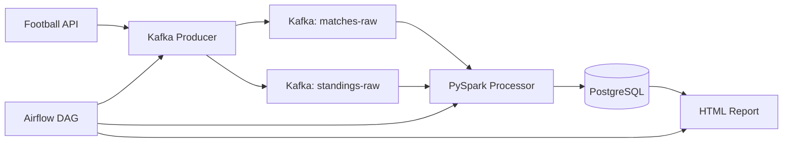

# GoalFlow Analytics Pipeline

A production-quality Data Engineering portfolio project demonstrating a real-time football analytics pipeline.

## Architecture

## Prerequisites
- Docker Desktop 4.x
- Make

## Quick Start
1. `cp .env.example .env` and add your API key.
2. `make up`
3. Open http://localhost:8080 for Airflow (admin/admin).

## Services Overview

| Service | Port | Description |
| --- | --- | --- |
| PostgreSQL | 5432 | Relational storage for transformed data |
| Airflow | 8080 | Workflow orchestration DAG runs |
| Kafka | 9092 | Message broker for raw JSON payloads |

---

**Author: Mohamed Chaari**
Data Engineering Student, ISIMS Sfax
